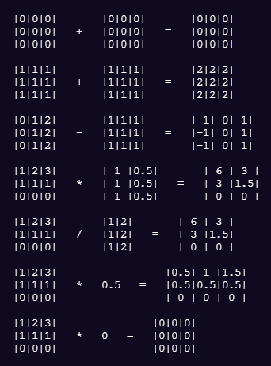
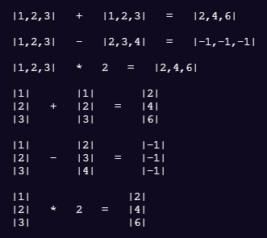
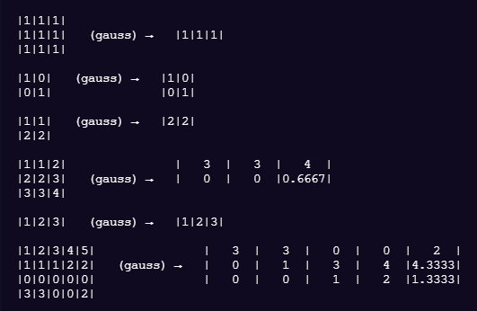

[](https://www.gnu.org/licenses/lgpl-3.0)

[](code_of_conduct.md)

### Il progetto è fondamentalmente chiuso, data la sua natura di mero esercizio di coding.

# Vettoriale

> Questa libreria vuole essere un piccolo esempio pratico di uso del linguaggio TypeScript
attraverso l'implementazione di una libreria sugli spazi vettoriali. In particolare si vuole dare enfasi alle potenzialità dell'uso combinato della tipizzazione e del paradigma di programmazione ad oggetti attraverso l'uso dei Generics.

## Si lasciano da implementare come esercizio:

### coordinate.ts
-  ```class Coordinata<T extends iNumero>```
-  ```class Coordinate<T extends iNumero>```
-  ```class CoordinateCartesiane<T extends iNumero>```
-  ```class CoordinatePolari<T extends iNumero>```

### spazio-vettoriale.ts
-  ```norma(): Reale```
-  ```distanza(t: T): Reale```
-  ```dipendenteDa(ts: T[]): true | false```
-  ```indipendenteDa(ts: T[]): true | false```

### spazio-vettoriale.ts
-  ```function gaussJordan(matrice: Matrice) : Matrice```

# Indice

- [Come iniziare](#come-iniziare)
- [Licenza](#licenza)

# Come iniziare

## Dipendenze
vedi file package.json per le versioni:

### testing
    @types/chai
    @types/mocha
    chai
    mocha
    nyc

### compilazione
    npm-run-all
    del-cli
    ts-node
    typescript

## Come installare

    $ git clone https://github.com/JoeFerri/vettoriale
    $ cd ../path/to/the/file
    $ npm start

## installare le dipendenze per il testing
    $ cd ../path/to/the/file
    $ npm i -D chai mocha nyc ts-node typescript
    $ npm i -D @types/chai @types/mocha

## avviare i test

    $ npm t

## avviare i test coverage

    $ npm run coverage

## Documentazione
Per la documentazione si vedano le note interne al codice sorgente.

## Struttura del progetto
La struttura del progetto è autodeterminata dal meccanismo costruttivo di scrittura del codice, e nello specifico si basa su un'unica cartella *lib* contenente i sorgenti in TypeScript, e su un'unica cartella *dist* contenente i files JavaScript generati dalla compilazione.

### gerarchia files
- operatori.ts
- - numeri.ts
- - - insieme.ts
- - - - coordinate.ts
- - - - - spazio-vettoriale.ts
- - - - - - matrice.ts
- - - - - - - gauss.ts

## Community

### Code of conduct
[Codice di condotta](code_of_conduct.md)

# Esempi su terminale
Gli esempi sono stati generati utilizzando la funzione ```printOnOneLine``` del modulo *print.ts*.





# Licenza 

## Licenza generale 

GNU Lesser General Public License v3.0 only

  Copyright (C) 2021 Giuseppe Ferri

  This program is free software: you can redistribute it and/or modify
  it under the terms of the GNU General Public License as published by
  the Free Software Foundation, either version 3 of the License, or
  (at your option) any later version.

  This program is distributed in the hope that it will be useful,
  but WITHOUT ANY WARRANTY; without even the implied warranty of
  MERCHANTABILITY or FITNESS FOR A PARTICULAR PURPOSE.  See the
  GNU General Public License for more details.

  You should have received a copy of the GNU General Public License
  along with this program.  If not, see <https://www.gnu.org/licenses/>.
